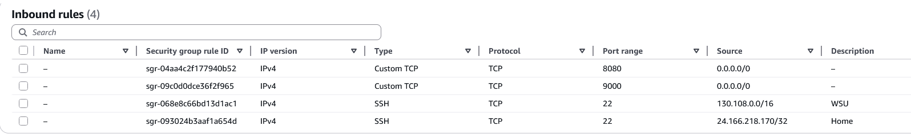

## Continuous Deployment Project
### Goal of the Project:
To establish a  Continuous Integration  and Continuous Deployment  pipeline that pushes code changes from GitHub to a website running in a Docker container on an Amazon EC2 instance.
### Tools Used and Roles:
* GitHub: Hosts the source code and triggers the workflow (CI/CD source). 
* GitHub Actions: Runs the CI workflow (builds, tests, pushes the Docker image) and sends the deployment signal (CD trigger). 
* Docker Hub: Stores the final built Docker images. 
* Amazon EC2: Hosts the application container. 
* adnanh/webhook: Runs on the EC2 instance, listens for the  deployment signal, and executes the local script. 
* Docker Engine: Manages the container on the EC2 instance.
## Diagram of Project:

## Resources:
* https://github.com/adnanh/webhook
    * Used for help with installing webhook and `hooks.json`
* https://levelup.gitconnected.com/automated-deployment-using-docker-github-actions-and-webhooks-54018fc12e32
    * Used for help with `hooks.json` and upddating my yml file for github actions
* https://linuxhandbook.com/create-systemd-services/
    * Used for help with setting up `webhook.serve`

## Part 1:
1. EC2 instance details
    * AMI information: ami-0ecb62995f68bb549 ubuntu
    * Instance typeL t2.medium
    * Volume Size: 30GB
    * Security Group configuration:
    
    * Security Group configuration justification: 
        * SSH rules are to allow only connections from my home and Wright State University.
        * Custom TCP 8080: Application is running inside Docker container mapped to port 8080 on the EC2 host (8080:80), with 0.0.0.0/0 so anyone can view the website.
        * Custom TCP 9000: The `adnanh/webhook` listener is running on port 9000. It needs to be open to receive the deployment signal from GitHub Actions,

2. Docker Setup on OS on the EC2 instance
    * How to install Docker for OS on the EC2 instance:
    `sudo apt install docker.io`
    * Additional dependencies based on OS on the EC2 instance:
    `bridge-utils containerd dns-root-data dnsmasq-base pigz runc ubuntu-fan`
    * How to confirm Docker is installed: `docker version`
    * How to confirm OS can run containers: `docker run hello-world`
        

3. Testing on EC2 Instance
    * How to pull container image from DockerHub repository: `docker pull coyryan/elden-cake:latest`
    * How to run container from image: `docker run -it -p 8080:80 coyryan/elden-cake:latest`
        * Flag Recommendation: Use the `-d`  and `--restart=always` flags once testing is complete. The `-it` flag is only for interactive debugging.
    * How to verify that the container is successfully serving the web application: `http://98.89.224.250:8080/` Visit the website in browser. 

4. Scripting Container Application Refresh

    * Description of the bash script: The refresh_container.sh script automates the deployment cycle by stopping/removing the old container, pulling the newest latest image from DockerHub, and starting a new container with persistent restart flags.

    * How to test / verify that the script successfully performs its taskings: Run the script locally `./refresh_container.sh`. Verify success by checking the new container ID in `docker ps` and confirming the site is still accessible at `http://18.215.182.80:8080/` 

    * LINK to bash script:
        * https://github.com/WSU-kduncan/cicdf25-CoyRy/blob/main/deployment/refresh_container.sh

## Part 2: Listen
1. Configuring a webhook Listener on EC2 Instance
    * How to install adnanh's webhook to the EC2 instance: 
        * `sudo apt-get install webhook`
        * To get binaries `wget https://github.com/adnanh/webhook/releases/download/<version>/webhook-linux-amd64.tar.gz`
        * `tar -xzf webhook-linux-amd64.tar.gz`
        * `sudo mv webhook-linux-amd64/webhook /usr/local/bin/webhook`
        * `sudo chmod +x /usr/local/bin/webhook` to make it executable
    * How to verify successful installation: `webhook -version`
    * Summary of the webhook definition file:
        * `id`: Unique identifier for the hook (elden-cake-deploy).

        * `execute-command`: Specifies the local script to run (/home/ubuntu/deployment/refresh_container.sh).

        * `trigger-rule`: Validates the payload using a shared payload-secret to ensure the request is from a trusted source.
    * How to verify definition file was loaded by webhook: Inspect the logs via `journalctl -u webhook`
    * How to verify webhook is receiving payloads that trigger it
        * Monitor logs: `sudo journalctl -u webhook -f` will show the output of the hook, including if the script was executed.
        * Docker process views: `docker ps` should show a new container ID and the running container's start time will be updated.
    * LINK to definition file in repository
        * https://github.com/WSU-kduncan/cicdf25-CoyRy/blob/main/deployment/hooks.json
2. Configure a webhook Service on EC2 Instance
    * Summary of webhook service file contents: Sets the service description, specifies `ExecStart` to run the webhook binary pointing to the `hooks.json` file, enables `Restart=always`, and runs the service as the ubuntu user.
    * How to enable and start the webhook service:
        * `sudo systemctl daemon-reload`
        * `sudo systemctl enable webhook.service`
        * `sudo systemctl start webhook.service`
    * How to verify webhook service is capturing payloads and triggering bash script:
    * LINK to service file in repository:
        * https://github.com/WSU-kduncan/cicdf25-CoyRy/blob/main/deployment/webhook.service

## Part 3: Send a Paylod
### Configuring a Payload Sender

### Justification for selecting GitHub as the payload sender: 
Github was selected because it offered the secret feature and the `github-secret` validation type in `hooks.json` which provided a bit more security then DockerHub.
### How to enable your selection to send payloads to the EC2 webhook listener: 
 Deployment trigger is executed using `CoyRy/webhook-action`, which is configured to send an authenticated payload to the EC2 instance.
### Explain what triggers will send a payload to the EC2 webhook listener: 
The payload is sent only when the Continuous Integration process is fully successful, then `redeploy` triggers the payload.
### How to verify a successful payload delivery: 
Use `sudo journalctl -u webhook -f` to monitor on the EC2 instance, after pushing new tag on local system should see a final HTTP 200 status code and the message `finished handling elden-cake-deploy`.
### How to validate that your webhook only triggers when requests are coming from appropriate sources: 
Used github-secret validation type, Github Actions and EC2 listener (`hooks.json`) have a shared secret used for validation. 
